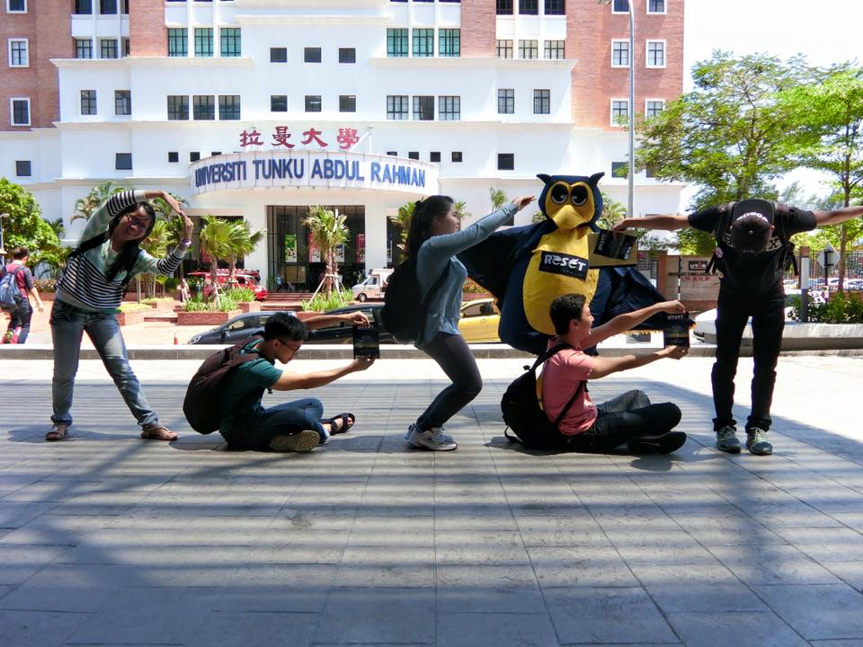
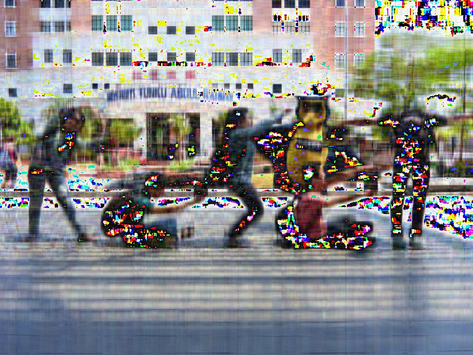
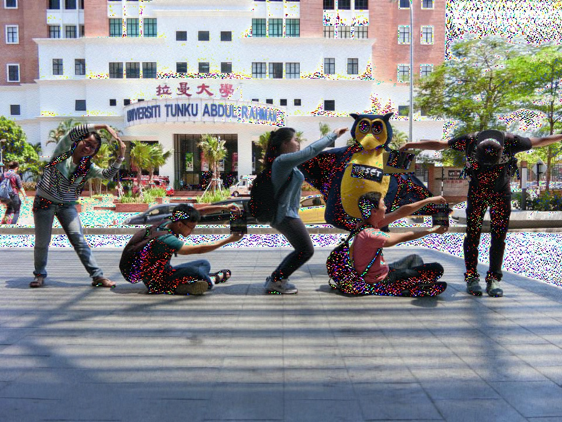

UECM3033 Assignment #2 Report
========================================================

- Prepared by: **** PAN ZI JOON****
- Tutorial Group: ****T2****

--------------------------------------------------------

## Task 1 --  $LU$ Factorization or SOR method

**The reports, codes and supporting documents are to be uploaded to Github at:** 

[https://github.com/zjpan123/UECM3033_assign2](https://github.com/zjpan123/UECM3033_assign2)

**Explain your selection criteria here.**

Firstly, I would determine if the matrix A is positive definite. If the matrix A is positive define, SOR method will be used to solve the system. If matrix A is not positive definite, LU decomposition will be used to solve the system. 

This is because, according to the Convergence theorem for SOR method, suppose that matrix A has positive diagonal elements and that $$ 0 <  ω < 2, $$ the SOR method converges for any $$ x^{(0)}$$ if and only if matrix A is positive definitive. 

Therefore, I have input a few conditions to determine if the matrix is positive definite, to do that I will check for the following:
1. Strictly Diagonally Dominant Matrix
2. Positive Definite
3. Positive Diagonal Element

**Explain how you implement your `task1.py` here.**

First of all, solve(A,b) will be undergo to check the property of the matrix as the condition checking will be initialised. The condition will decide whether LU decomposition or SOR method will be used to solve the system.

In LU decomposition, scipy.linalg.lu(A) is used to decompose matrix A to P, L and U. 
$$ A = PLU , Ax = b$$ $$ Ly = b $$ $$ Ux=y$$ 
x can be calculated using the equation above.

In SOR method, optimal ω will be find by using the formula below. If matrix A is positive definite, optimal ω will be found and range of 0 < ω < 2. This ω will make the solution coverge to the solution faster.

$$ Q = \frac{1}{w}(D - wL) $$ $$ A = D-L-U $$ $$ w = \frac{2[1-{\sqrt{1-p(Kj^2)}}]}{[p(Kj)]^2} $$ where $$Kj = D^{-1}(L+U)$$

$$ X^{k+1} = Q^{-1}(Q-A)X^{k} + Q^{-1}b$$

The iteration is set to be 20. The solution will converge within 20 iterations because optimal ω is used.

The solutions to the first set of 3-variables system of linear equations are

\begin{align} x_1=1,\;\;x_2=1,\;\;x_3=1.\end{align}
for second set of 6-variables system of linear equations are \begin{align} x_1=1.0000000000000062,\;\;x_2=-0.99999999999999689,\;\;x_3=4.0,\;\;x_4=-3.4999999999999951,\;\;x_5=7.0000000000000036,\;\;x_6=-1.0000000000000004.\end{align}

---------------------------------------------------------

## Task 2 -- SVD method and image compression

Put here your picture file (Reset.png)

**How many non zero element in $\Sigma$?**

There is N non zero element in $\Sigma$ . In our case, there are 800 non zero element in $\Sigma$ .

**Put here your lower and better resolution pictures. Explain how you generate these pictures from `task2.py`.**

Lower resolution picture. (Reset_lower.jpg)

Better resolution picture. (Reset_higher.jpg)

First, calculate a new $\Sigma_n$ with $n$ number of eigenvector used, 30 for lower resolution and 200 for better resolution. Both picture is then obtain by compute the matrix by U $\Sigma_n$ V for each color layer, then merge togehter to become an image in RGB format.

First, I get the RGB value from the image file. Then I use sci.linalg.svd to decompose the R,G and B matrices into $\Sigma$, U and V. The $\Sigma$ I got is a vector with dimension of (800,1). I modified it into a diagonal matrix with dimension of (800,1000). 

For Lower Resolution Picture
The first 30 diagonal elements are kept while the other none zero elements are set to zero.

For Better Resolution Picture
The first 200 diagonal elements are kept while the other none zero elements are set to zero.

Lastly, I combine $\Sigma$, U and V into R, G and B matrices again. The new RGB values are use to generate the lower resolution image and better resolution image.

What is a sparse matrix?

A sparse matrix is a matrix in which most of the elements are zero. In this assignment, we convert the vector $\Sigma$ to a diagonal matrix. We change the dimension of $\Sigma$ from [800,1] to [800,1000] which create a sparse matrix. There are 800 non zero element and 799200 zero element in our $\Sigma$.

-----------------------------------

last modified: 11 March 2016
